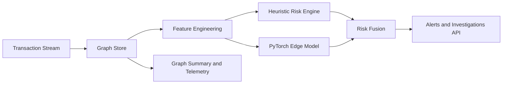

# Aegis Graph Fraud GNN

Real-time graph-native fraud ring detection system designed for applied ML/DL portfolios.

## Highlights

- Streaming transaction scoring with graph context.
- Hybrid risk engine: rule-informed heuristic + PyTorch edge classifier.
- Self-supervised pretraining (denoising autoencoder) before supervised edge classification.
- Explainable outputs with reason codes and top contributing signals.
- FastAPI production API, tests, Docker, CI.

## Architecture



## Core API

- `GET /health`
- `POST /api/v1/score`
- `POST /api/v1/simulate?events=250`
- `GET /api/v1/graph/summary`
- `GET /api/v1/alerts?min_score=0.82&limit=25`

Example score request:

```json
{
  "sender_id": "ACC_1201",
  "receiver_id": "ACC_7782",
  "amount": 19500,
  "currency": "USD",
  "channel": "wire",
  "country_from": "US",
  "country_to": "AE"
}
```

## Local Setup

```bash
cp .env.example .env
make setup
make run
```

API runs at `http://localhost:8090`.

## Training

Train a synthetic baseline model:

```bash
make train
```

Artifacts are stored at `artifacts/models/edge_model.pt`.

## Smoke Test

```bash
make smoke
```

## Docker

```bash
docker compose up -d --build
```

Exposed API: `http://localhost:18910`.

## Project Structure

```text
app/        FastAPI app, scoring engine, graph store, simulator
ml/         PyTorch model and self-supervised pretraining modules
scripts/    Training and smoke utilities
tests/      API tests
docker/     Container build files
```

## Roadmap

- Replace synthetic generator with Kafka ingestion connector.
- Add temporal GNN (GraphSAGE/GAT) with neighbor mini-batching.
- Add analyst UI for case graph exploration and path explanations.
- Add drift monitoring dashboards (population shift, alert precision proxy).

## License

MIT
