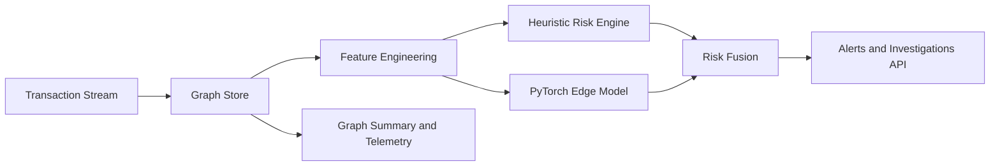

# Aegis Graph Fraud GNN

Real-time graph-native fraud ring detection system designed for applied ML/DL portfolios.

Live endpoints:

- Project page: `https://stelioszach.com/aegis-graph-fraud-gnn/`
- API health: `https://stelioszach.com/aegis-graph-fraud-gnn/live/health`
- API docs: `https://stelioszach.com/aegis-graph-fraud-gnn/live/docs`
- Grafana: `https://stelioszach.com/aegis-graph-fraud-gnn/monitoring/`
- Prometheus: `https://stelioszach.com/aegis-graph-fraud-gnn/prometheus/`

## Highlights

- Streaming transaction scoring with graph context.
- Hybrid risk engine: rule-informed heuristic + PyTorch edge classifier.
- Self-supervised pretraining (denoising autoencoder) before supervised edge classification.
- Explainable outputs with reason codes and top contributing signals.
- FastAPI production API, tests, Docker, CI.

## Architecture



## Core API

- `GET /health`
- `GET /metrics`
- `POST /api/v1/score`
- `POST /api/v1/simulate?events=250`
- `GET /api/v1/graph/summary`
- `GET /api/v1/alerts?min_score=0.82&limit=25`

Example score request:

```json
{
  "sender_id": "ACC_1201",
  "receiver_id": "ACC_7782",
  "amount": 19500,
  "currency": "USD",
  "channel": "wire",
  "country_from": "US",
  "country_to": "AE"
}
```

## Local Setup

```bash
cp .env.example .env
make setup
make run
```

API runs at `http://localhost:8090`.

## Training

Train a synthetic baseline model:

```bash
make train
```

Artifacts are stored at `artifacts/models/edge_model.pt`.

## Smoke Test

```bash
make smoke
```

## Docker

```bash
docker compose up -d --build
```

Exposed API: `http://localhost:18910`.

Run with monitoring stack:

```bash
docker compose --profile monitoring up -d --build
```

Monitoring endpoints:

- Prometheus: `http://localhost:19020`
- Grafana: `http://localhost:19030` (admin/admin)

VPS deployment profile:

```bash
docker compose -f docker-compose.vps.yml up -d --build
```

VPS exposed ports:

- API: `18910`
- Prometheus: `18920`
- Grafana: `18930`

## Project Structure

```text
app/        FastAPI app, scoring engine, graph store, simulator
ml/         PyTorch model and self-supervised pretraining modules
scripts/    Training and smoke utilities
tests/      API tests
docker/     Container build files
monitoring/ Prometheus + Grafana provisioning
```

## Benchmark

Run reproducible benchmark:

```bash
python3 scripts/benchmark.py --base-url http://localhost:18910 --requests 2500 --out benchmarks/benchmark_2026-02-28.json
```

The script reports:

- throughput (RPS)
- latency `mean/p50/p95/p99/max`
- success rate
- high-risk ratio

Latest benchmark snapshot (`2026-02-28`, final VPS deployment state):

- requests: `2500`
- success rate: `100%` (2500/2500)
- throughput: `457.402 rps`
- latency mean/p50/p95/p99/max: `2.169ms / 1.987ms / 3.270ms / 4.821ms / 85.213ms`
- high-risk ratio: `0.8604`

Raw output: `benchmarks/benchmark_2026-02-28.json`

## Roadmap

- Replace synthetic generator with Kafka ingestion connector.
- Add temporal GNN (GraphSAGE/GAT) with neighbor mini-batching.
- Add analyst UI for case graph exploration and path explanations.
- Add drift monitoring dashboards (population shift, alert precision proxy).

## License

MIT
