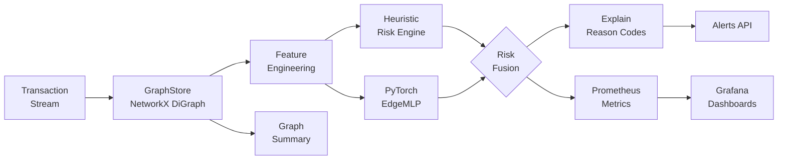

<div align="center">

[](https://github.com/stelioszach03/graph-fraud-command-center/actions)

# Aegis · Graph Fraud Command Center

**Real-time graph-native fraud scoring: 14 topology features, a hybrid heuristic + PyTorch MLP engine, and an operator console.**

[](https://www.python.org/)
[](https://pytorch.org/)
[](https://fastapi.tiangolo.com/)
[](https://networkx.org/)
[](https://prometheus.io/)
[](https://grafana.com/)
[](https://www.docker.com/)
[](LICENSE)

**[Live Dashboard](https://stelioszach.com/graph-fraud-command-center/)**  ·  **[API Docs](https://stelioszach.com/graph-fraud-command-center/live/docs)**  ·  **[Grafana](https://stelioszach.com/graph-fraud-command-center/monitoring/)**

</div>

---

## What it does

Every incoming transaction is enriched with **14 graph-context features** — velocity spikes, reverse-edge patterns, mule-flow ratios, first-time relationships, cross-border paths — and scored by a **hybrid risk engine** that fuses a hand-tuned heuristic with a PyTorch `EdgeMLP` trained on synthetic ring patterns. Every score is explainable, every metric is scraped, every alert is re-callable via API.

> **Measured load test** (not a production figure): **457.4 req/s**, **p95 3.27 ms**,
> 0 errors over **2 500 requests** — single container against `http://localhost:18910`,
> in-memory NetworkX graph store, no database.
> Raw JSON: [`benchmarks/benchmark_2026-02-28.json`](benchmarks/benchmark_2026-02-28.json).

> **`EdgeMLP` is a plain MLP over the 14 engineered edge features — not a
> message-passing GNN.** There is no PyG or DGL here, and it is trained on
> synthetically generated ring patterns.

## Highlights

- **Streaming scorer** — one POST → enriched features → heuristic + model → explainable risk band.
- **Hybrid fusion** — hand-tuned heuristic (14 weighted features) blended with a PyTorch classifier at weight 0.15; `uplift_only` guarantees the model never suppresses a strong rule signal.
- **Self-supervised pretraining** — denoising autoencoder warms up feature representations before supervised training.
- **Live graph store** — NetworkX DiGraph with O(1) degree/in-out-total lookups, sliding-window velocity counters, and neighborhood BFS.
- **Reason codes + top features** — every score returns human-readable reasons and the 6 highest-contributing features.
- **Operator-grade observability** — 11 Prometheus metrics (histograms for latency, score, model uplift delta; counters for requests, alerts; gauges for graph cardinality).
- **Zero-dependency frontend** — dark SOC-terminal landing page with live simulation, alert stream, and SVG force graph. No React, no build step, ~40 KB.
- **Reproducible benchmark + eval** — deterministic quality metrics (precision/recall/F1 by threshold) and latency benchmark scripts.

## Architecture


```mermaid
flowchart LR
    A["Transaction<br/>Stream"] --> B[GraphStore<br/>NetworkX DiGraph]
    B --> C[Feature<br/>Engineering]
    C --> D[Heuristic<br/>Risk Engine]
    C --> E[PyTorch<br/>EdgeMLP]
    D --> F{Risk<br/>Fusion}
    E --> F
    F --> G[Explain<br/>Reason Codes]
    G --> H[Alerts API]
    B --> I[Graph<br/>Summary]
    F --> J[Prometheus<br/>Metrics]
    J --> K[Grafana<br/>Dashboards]
```

## Features (the 14)

| # | Feature | Signal |
|---|---------|--------|
| 1 | `log_amount` | magnitude normalized |
| 2 | `amount_z` | distance from sender's baseline (warmed up via global prior) |
| 3 | `sender_out_degree` | out-degree of sender |
| 4 | `receiver_in_degree` | in-degree of receiver |
| 5 | `sender_velocity_10m` | sender-originated events in last 10 min |
| 6 | `receiver_velocity_10m` | receiver-absorbing events in last 10 min |
| 7 | `is_new_pair` | first-time relationship between these two nodes |
| 8 | `has_reverse_edge` | bidirectional circular flow |
| 9 | `cross_border` | country_from ≠ country_to |
| 10 | `channel_risk` | {wire, crypto, cash, ach, card} prior risk |
| 11 | `sender_receiver_flow_ratio` | mule asymmetry between in-flow and out-flow |
| 12 | `shared_counterparties` | overlap in sender-successors and receiver-predecessors |
| 13 | `sender_new_account` | sender first seen in last hour |
| 14 | `receiver_new_account` | receiver first seen in last hour |

## API

### Endpoints

| Method | Path | Description |
|--------|------|-------------|
| `GET` | `/` | Service info + current graph summary |
| `GET` | `/health` | Health + model + graph state |
| `GET` | `/metrics` | Prometheus exposition |
| `POST` | `/api/v1/score` | Score a single transaction |
| `POST` | `/api/v1/simulate` | Generate a synthetic stream (events + seed) |
| `POST` | `/api/v1/reset` | Flush graph/events/alerts for deterministic demos |
| `GET` | `/api/v1/graph/summary` | Graph cardinality + high-risk last hour |
| `GET` | `/api/v1/graph/neighborhood/{node_id}` | BFS neighborhood (depth ≤ 2) |
| `GET` | `/api/v1/alerts` | Latest alerts above threshold |

### Example

```bash
curl -s -X POST https://stelioszach.com/graph-fraud-command-center/live/api/v1/score \
  -H 'Content-Type: application/json' \
  -d '{
    "sender_id": "ACC_1201",
    "receiver_id": "RING_007",
    "amount": 19500,
    "channel": "crypto",
    "country_from": "US",
    "country_to": "AE"
  }' | jq
```

```json
{
  "tx_id": "TX-ab7c2f91e4d308",
  "risk_score": 0.931,
  "risk_band": "critical",
  "model_score": 0.912,
  "heuristic_score": 0.928,
  "reasons": [
    "Amount is far above sender baseline",
    "First-time relationship between sender and receiver",
    "Cross-border payment path",
    "High-risk payment channel"
  ],
  "top_features": {
    "amount_z": 0.9214,
    "cross_border": 1.0,
    "channel_risk": 0.92,
    "is_new_pair": 1.0,
    "log_amount": 0.861,
    "sender_velocity_10m": 0.450
  },
  "processed_at_utc": "2026-04-15T16:09:43Z"
}
```

## Quickstart

### Local (venv)

```bash
git clone https://github.com/stelioszach03/graph-fraud-command-center.git
cd graph-fraud-command-center
cp .env.example .env

make setup   # creates .venv and installs requirements
make train   # trains EdgeMLP on synthetic data (≈15s)
make run     # uvicorn on :8090 with reload

# smoke + benchmark
make smoke
make benchmark
```

### Docker

```bash
docker compose -f docker-compose.vps.yml up -d --build
```

Exposed ports: API `18910`, Prometheus `18920`, Grafana `18930`.

## Benchmarks

Conditions, so the numbers mean something: **single container on `localhost:18910`**,
NetworkX in-memory graph store, **no database**, **2 500 requests**, run 2026-02-28.
This measures the scoring path on one machine — it is not a distributed or
production-traffic result.

| Metric | Value |
|--------|-------|
| Requests | 2 500 |
| Success | 100.0% |
| Throughput | **457.4 req/s** |
| Latency mean | 2.17 ms |
| Latency p50 | 1.99 ms |
| Latency p95 | **3.27 ms** |
| Latency p99 | 4.82 ms |
| High-risk ratio | 0.86 |

Raw: [`benchmarks/benchmark_2026-02-28.json`](benchmarks/benchmark_2026-02-28.json)

Run it yourself:

```bash
python3 scripts/benchmark.py --base-url http://localhost:18910 --requests 2500
```

## Quality Evaluation

```bash
make eval
```

Writes `benchmarks/quality_latest.json` locally — **it is not committed, and
deliberately so.** The labels come from `_label_rule()` in
[`scripts/evaluate_quality.py`](scripts/evaluate_quality.py), applied to a stream
produced by the repo's own simulator. Those precision/recall/F1 numbers measure
**agreement between the scorer and a hand-written rule on synthetic data** — they
say nothing about real fraud detection, so publishing them as a headline metric
would be misleading. Run it yourself to tune thresholds; current operating point
is `alert_min_score = 0.80` with `MODEL_UPLIFT_ONLY = true`.

## Observability

Every request records:
- `aegis_http_requests_total{method,path,status}`
- `aegis_http_request_duration_seconds{method,path}` — histogram
- `aegis_risk_score` — histogram
- `aegis_heuristic_score` — histogram
- `aegis_model_score` — histogram
- `aegis_model_uplift_delta` — histogram of `final − heuristic`
- `aegis_high_risk_alerts_total`
- `aegis_score_requests_total`
- `aegis_graph_nodes_total`, `aegis_graph_edges_total`
- `aegis_events_total`, `aegis_alerts_total`

Prometheus scrapes `/metrics` → Grafana dashboard auto-provisioned under `monitoring/grafana/dashboards/aegis-overview.json`.

## Project Layout

```text
app/
├── main.py                    FastAPI routes, middleware, CORS
├── schemas.py                 Pydantic request/response models
├── settings.py                Env-driven configuration
├── metrics.py                 Prometheus histograms + counters + gauges
└── services/
    ├── graph_store.py         NetworkX store + neighborhood BFS
    ├── feature_engineering.py 14 edge-level features
    ├── scoring.py             Heuristic + GNN fusion engine
    ├── explain.py             Reason codes + top features
    └── simulator.py           Synthetic fraud-laced stream

ml/
├── gnn.py                     EdgeMLP + trainer + checkpoint I/O
└── self_supervised.py         Denoising autoencoder pretraining

scripts/
├── train_synthetic.py         End-to-end training pipeline
├── benchmark.py               Concurrent latency benchmark
├── evaluate_quality.py        Precision/recall/F1 sweep
└── smoke.sh                   End-to-end curl smoke test

tests/                         Pytest suite (score, health, quality)
monitoring/                    Prometheus + Grafana provisioning
docker/                        Dockerfile.api
```

## Configuration

Configured via `.env` (see `.env.example`):

| Variable | Default | Purpose |
|----------|---------|---------|
| `APP_ENV` | `dev` | logging + behavior flags |
| `APP_VERSION` | `0.2.0` | reported in `/` and `/health` |
| `MODEL_PATH` | `artifacts/models/edge_model.pt` | checkpoint path |
| `ALERT_MIN_SCORE` | `0.80` | threshold for high-risk alert routing |
| `MODEL_BLEND_WEIGHT` | `0.15` | weight of GNN in final score |
| `MODEL_UPLIFT_ONLY` | `true` | model can only raise, never suppress |
| `AMOUNT_Z_WARMUP_EVENTS` | `6` | blend with global prior under this sender-event count |
| `CORS_ALLOW_ORIGINS` | `*` | comma-separated allowlist |

## Limitations

- **All data is synthetic**, generated by `app/services/simulator.py`. No real
  transaction data has ever passed through this service.
- **No detection-quality claim.** See *Quality Evaluation* above — the only
  available labels are rule-generated, so agreement with them is not accuracy.
- **`EdgeMLP` is an MLP, not a GNN.** Graph structure enters only through the 14
  precomputed features; there is no neighbourhood aggregation in the model.
- **The benchmark is single-container, in-memory, localhost.** No database, no
  network hop, no concurrency beyond the load script.
- **State is in-process.** Restarting the API empties the graph; there is no
  persistence layer.

---

## Roadmap

- [ ] Replace synthetic generator with Kafka ingestion connector
- [ ] Temporal GNN (GraphSAGE / GAT) with neighbor mini-batching
- [ ] Analyst UI for case graph exploration + path-level explanations
- [ ] Drift monitoring dashboards (population shift, alert precision proxy)
- [ ] Shadow-mode A/B for model iteration under production traffic

---

<div align="center">

Built by **[Stelios Zacharioudakis](https://stelioszach.com)** · ML Engineer & Researcher · Athens → Toronto

[Portfolio](https://stelioszach.com) · [GitHub](https://github.com/stelioszach03) · [LinkedIn](https://www.linkedin.com/in/stylianos-georgios-zacharioudakis-47024428a)

</div>
